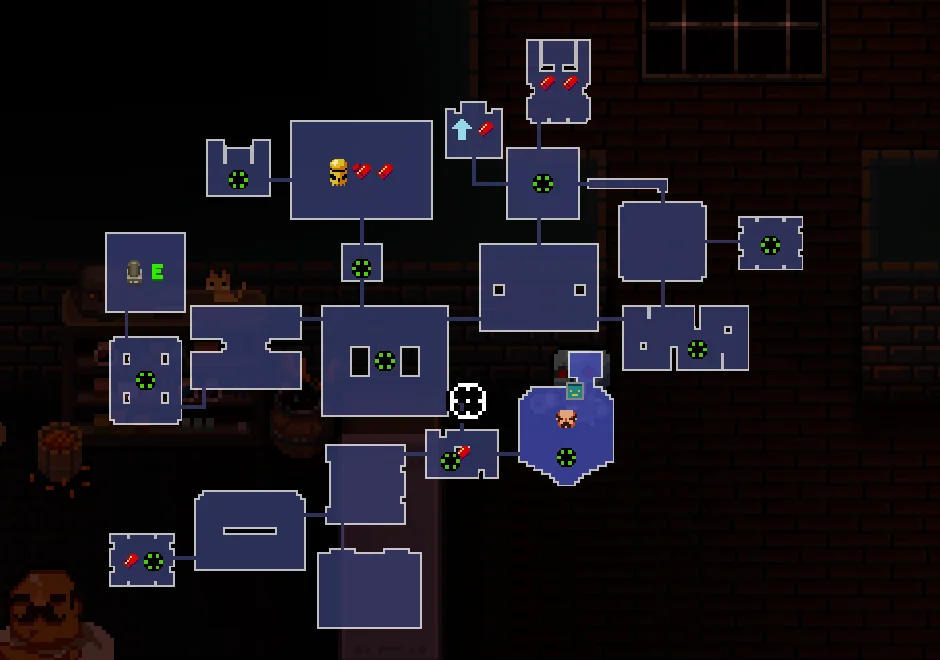

# Getting Started

This plugin is inspired by the procedural map generation algorithm used in the `Enter The Gungeon` game, designed to create unique map patterns for each level with predefined rooms.

### Example of a Map from Enter The Gungeon

The plugin recognizes three types of rooms

1. **Normal Room**: Features a single entrance and exit.
2. **Large Room**: Contains one entrance and multiple exits (at least 2, with no fixed maximum).
3. **No Exit Room**: Has an entrance but no exits.

### How It Works

- The map generation process begins with a random selection of **predefined rooms**. Despite the rooms being predefined, the random sequence of room spawning, inclusion of **Large Rooms**, and corridor patterns ensure a fresh experience in each game session.
- Rooms are spawned based on their predefined entrance and exit locations, with the map starting at the player's start map and concluding with a boss room.
- In cases where a Large Room is selected (featuring multiple exits), the algorithm initiates branching. For more details on branching, see [Branching and Large Room](BranchingAndLargeRoom.md).
- Overlaps with other rooms, corridors, or specified blocks can occur during room spawning. For more information, refer to [Overlaps](Overlaps.md).

## Plugin Structure

The plugin package includes three main types: `ProceduralGen`, `RoomActor`, and `DoorActor` (a specialized form of RoomActor), designed for maximum flexibility.

### RoomActor

A Room Actor is composed of three components, demonstrated in the `ProceduralMapGeneration Content -> ProceduralMapGeneration -> ETGRooms -> Room1` path:

- `DoorSocketEnter`: Indicates the room's starting and pivot point.
- `DoorSocketExit`: Marks the room's ending point.
- `Box Component`: Encompasses the entire room. The box's dimensions must be multiples of the [Tile size](References/ProGenActor.md#general-map-settings-for-procedural-gen), with TileSizeX & TileSizeY given 16 as default.

**Critical Note**: The pivot origin of all rooms must be positioned at `DoorSocketEnter`.

### Setting the Pivot Point

1. In the Components tab, select all components using `CTRL + A`.
2. Adjust the gizmo to align with the `Door Socket Enter`. This ensures rooms spawn at the correct location.

### Configuring Enter and Exit Directions

For example, if `DoorSocketEnter` is positioned at the top, indicating the entrance, and `DoorSocketExit` at the right, indicating the exit, set the `Door Enter Socket Direction` to `Vertical Up` and the `Door Exit Socket Direction` to `Horizontal Right`. This setup is essential for the algorithm to correctly select and spawn rooms.

### Procedural Gen

This actor configures the settings for the procedural map generation algorithm. For detailed attribute information, refer to the [references](References/ProGenActor.md).

## Algorithm Overview

If the plugin operates outside debugging mode (with `Debug Room Sequence` and `Block Room Locations` empty), the following steps occur:

- A room is randomly selected from the [Room Designs](References/ProGenActor.md).
- Rooms are sequentially spawned at the exit socket of the preceding room, continuing until the specified [Number of Rooms](References/ProGenActor.md) is reached.
- If [overlap](Overlaps.md) occurs during room spawning, the overlapped room will move away from previous room's exit socket location and a corridor path will be constructed to connect two rooms .
- If a `Large Room` is selected, the algorithm initiates branching and only terminates with `NoExit` rooms. For more details on branching, see [branching](BranchingAndLargeRoom.md).

## Final Steps

Tile indexes are selectable via [Command Prompts](CommandPrompts.md), with editor widgets available to simplify room configuration. Refer to [Slate Editor](SlateEditor.md) for guidance.

Before generating maps, ensure all prerequisites are met by consulting the [Essential Checklist](EssentialChecklist.md). Rooms and configurations in the content browser are provided for reference.
